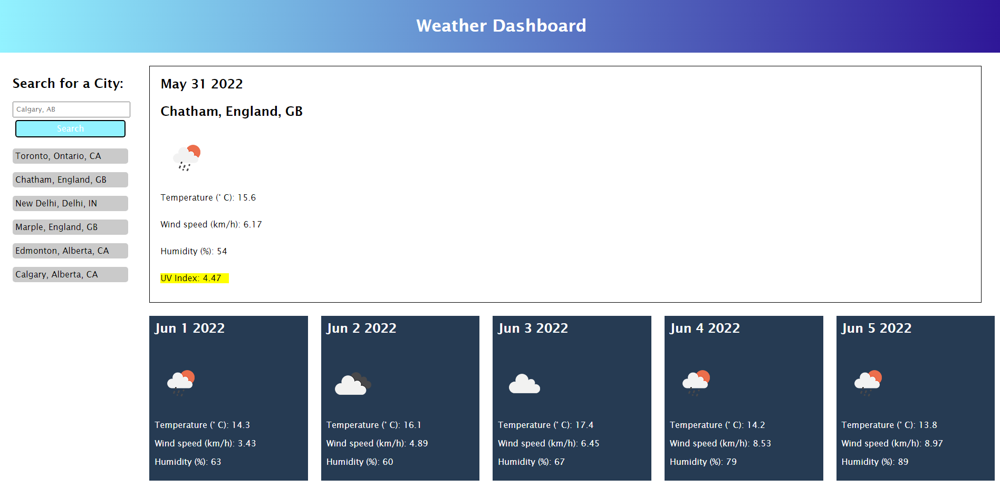

## Challenge 6 - Weather Dashboard

For Challenge 6, the requirement was to aconstruct a site where the user can enter a city name into a form field and clikc the search button to show the current and future weather for the kocation. 

The linked application will search for a city and find the first one it identifies whose name matches the search term, or will respond with an alert if no matches are found.

Searched cities are added to the sidebar, and can be re-searched with a click.

The dashboard will display the current weather conditions, including temperature, an icon showing weather, humidity, wind speed, and UV Index. The UV Index is color coded based on how high it is (<4 for low, 4-7 for moderate, and greater than 7 for high). 

The application draws on a geolocation API as well as a weather API, both from OpenWeather.

Github Repository: https://github.com/nathanh635/WeatherDashboard

Deployed Page: https://nathanh635.github.io/WeatherDashboard/